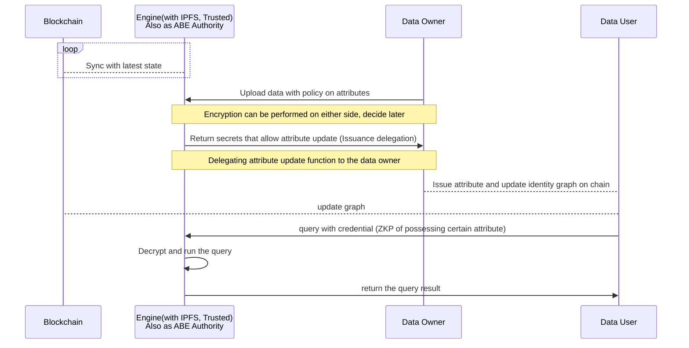
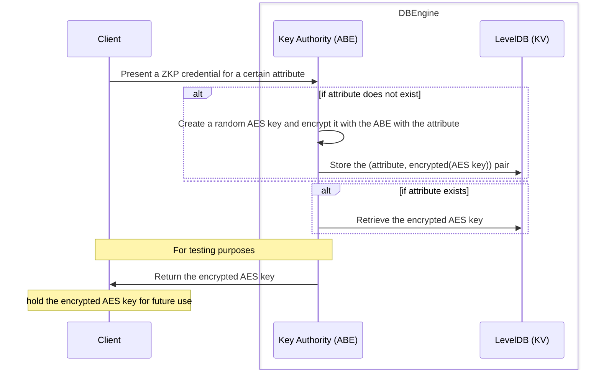

# ACModule
The access control module for Web3DB project (in development).

# Overview

```mermaid
sequenceDiagram
    Participant B as Blockchain 
    Participant E as Engine(with IPFS, Trusted) <br>Also as ABE Authority
    Participant DO as Data Owner
    Participant DU as Data User

    loop
    E --> B: Sync with latest state
    end
    DO ->> E: Upload data with policy on attributes
    note over DO, E: Encryption can be performed on either side, decide later
    E ->> DO: Return secrets that allow attribute update (Issuance delegation)
    
    note over DO, E: Delegating attribute update function to the data owner 
    DO --> DU: Issue attribute and update identity graph on chain
    DU --> B: update graph

    DU ->> E: query with credential (ZKP of possessing certain attribute)
    E ->> E: Decrypt and run the query
    E ->> DU: return the query result

```

## Attribute, ABE, and AES key

```mermaid
sequenceDiagram
    participant C as Client
    box DBEngine
    participant KA as Key Authority (ABE)
    participant KV as LevelDB (KV)
    end
    C ->> KA: Present a ZKP credential for a certain attribute
    alt if attribute does not exist
    KA ->> KA: Create a random AES key and encrypt it with the ABE with the attribute
    KA ->> KV: Store the (attribute, encrypted(AES key)) pair
    else
    end
    alt if attribute exists
    KA ->> KV: Retrieve the encrypted AES key
    end
    note over C, KA: For testing purposes
    KA ->> C: Return the encrypted AES key
    note over C: hold the encrypted AES key for future use
```

